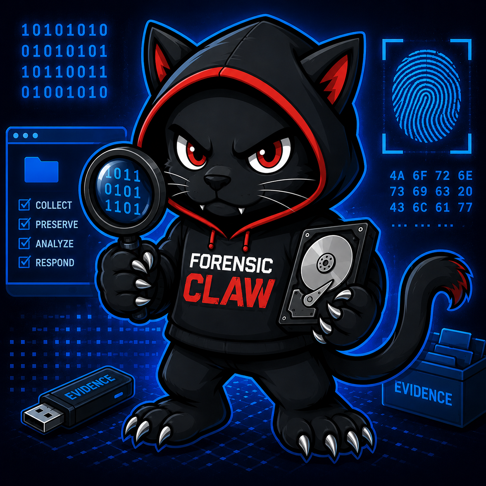

# Forensic Claw

<p align="center">
  
</p>

A self-contained DFIR (digital forensics & incident response) workstation, packaged as a Docker setup. You bring evidence — disk images, memory dumps, packet captures, log archives, suspect binaries. The agent picks the right forensic tool for the job, runs it under your supervision, and writes findings into a per-case folder you can review and share.

Built on top of [OpenClaw](https://github.com/phioranex/openclaw-docker), pre-loaded with the forensic toolchain (Sleuth Kit, Volatility, Plaso, Wireshark/tshark, exiftool, YARA, foremost, …) and a curated set of agent skills that know how to use them safely.

---

## What you'll need

- **Docker Desktop** (Windows/macOS) or **Docker Engine + Compose v2** (Linux). Check with `docker --version` and `docker compose version`.
- **An API key** for one model provider:
  - Anthropic Claude — [console.anthropic.com](https://console.anthropic.com/)
  - OpenAI — [platform.openai.com/api-keys](https://platform.openai.com/api-keys)

  Either works. You can switch later by re-running the onboarding wizard.

- A free TCP port for the dashboard (default `18789`).

---

## Get it running

### 1. Get the files and `cd` into the folder

```bash
git clone https://github.com/birdman4512/forensic-claw.git
cd forensic-claw
```

### 2. Run it once — it'll create your `.env` and bail

```bash
./start.sh           # Linux / macOS / Git Bash on Windows
.\start.ps1          # Windows PowerShell
```

First run: there's no `.env` yet, so the script copies `.env.example` to `.env` and exits with instructions. Open `.env` in an editor and fill in **just these four**:

```dotenv
ANTHROPIC_API_KEY=sk-ant-...
OPENCLAW_CASES_HOST_PATH=/absolute/path/to/forensic-claw/cases
DOCKER_GID=0
OPENCLAW_TZ=Australia/Brisbane
```

- `ANTHROPIC_API_KEY` (or `OPENAI_API_KEY`) — your provider key.
- `OPENCLAW_CASES_HOST_PATH` — the **absolute** path to `./cases` on your machine. Some forensic tools run in their own containers and need a real host path to mount your evidence.
  - Linux/macOS: `/home/you/forensic-claw/cases`
  - Windows: `C:/Users/you/forensic-claw/cases`
- `DOCKER_GID` — usually `0` on Docker Desktop. On a Linux host, run `stat -c '%g' /var/run/docker.sock` and use that number.
- `OPENCLAW_TZ` — your timezone (uses standard names like `America/New_York`, `Europe/London`).

> ⚠ Don't put a `# comment` after a value on the same line — `.env` keeps the whole rest of the line as part of the value, which silently breaks things. Comments belong on their own lines.

### 3. Pick your model

```bash
docker compose run --rm openclaw-cli onboard
```

An interactive wizard. It detects the API key from your `.env`, asks which provider to use, and asks which model. For Claude, pick the latest Sonnet or Opus. For OpenAI, pick GPT-4o or newer. Your choice is saved to `./config/`. Compose will build the image on demand the first time this runs (~3–8 min).

### 4. Start it

```bash
./start.sh           # Linux / macOS / Git Bash on Windows
.\start.ps1          # Windows PowerShell
```

Now that `.env` is filled in, the same script seeds workspace templates, generates a gateway token, wires git hooks, brings everything up, waits for the health check, and prints the dashboard URL. Safe to re-run any time — it's idempotent.

> Windows note: if PowerShell blocks the script with an execution-policy error, either run it once via `powershell -ExecutionPolicy Bypass -File .\start.ps1`, or allow signed-and-local scripts for your user with `Set-ExecutionPolicy -Scope CurrentUser RemoteSigned`.

### 5. Open the dashboard

Visit [http://localhost:18789](http://localhost:18789), or the port you set in `OPENCLAW_GATEWAY_PORT`.

If it asks for a token, get the launch URL with the token embedded:

```bash
docker compose run --rm openclaw-cli dashboard --no-open
```

Open the printed URL — you're in.

---

## Use it: a typical case

The agent works in **cases**. A case is a folder under `./cases/<case-id>/` with a fixed structure: a brief, status, findings, a worklog, an evidence dir, and an outputs dir. Everything you and the agent do is captured there, so you can read it later or hand it to someone else.

### Drop in your evidence

Make a folder under `./cases/` named however you like (`CASE-001`, `incident-2026-05-15`, `client-acme-q2`, …) and copy your artefacts into it — packet captures, memory dumps, disk images, suspect binaries, log archives, anything. The folder structure is flat: one subfolder per case directly under `./cases/`.

### Hand the case to the agent

Open the dashboard, start a new conversation, point the agent at `cases/`, and tell it what you want answered. For example:

> "Look at what's under `cases/`. There's an OT-PCAP folder with three packet captures. Identify any unusual traffic, build a timeline of attacker activity, and answer: (1) what was the initial entry vector, (2) which hosts were involved, (3) was any data exfiltrated. Put findings in `findings.md`."

The agent will set up the standard case scaffolding (`brief.md`, `status.json`, `findings.md`, `notes/worklog.md`, `evidence/`, `outputs/`) the first time it touches a case folder — you don't need to pre-create those files.

The agent will:

- Read your case `brief.md` and `status.json` to understand scope.
- Pick the right tool (tshark, Volatility, Plaso, exiftool, etc.) and call it via the **wrappers** in `workspace/tools/`. Every tool invocation is auto-logged.
- Save substantive output (extracted artefacts, generated timelines, parsed logs) into the case `outputs/` folder.
- Append a chronological log of what it did to `notes/worklog.md`.
- Write report-ready findings into `findings.md`.
- Update `status.json` as it makes progress.

You stay in the loop the whole time — the dashboard shows what the agent is doing and you can interject, redirect, or stop at any point.

### Read the results

When the agent says it's done (or you're satisfied), open the case folder:

- **`findings.md`** — the report-ready summary you'd hand to a stakeholder.
- **`notes/worklog.md`** — chronological log of every step, in case anyone asks "how did you arrive at that?"
- **`outputs/`** — extracted artefacts, timelines, parsed logs.
- **`status.json`** — current state machine-readable.
- **`logs/tool-command-history.md`** (project root) — every forensic tool invocation across all cases, with timestamp + exit code.

You can rename, archive, copy out, or zip up the case folder once you're done. It's just files.

---

## Daily use

```bash
./start.sh                                          # bring it up (Linux/macOS); use .\start.ps1 on Windows
docker compose down                                 # take it down
docker compose logs -f openclaw-gateway             # tail the gateway logs
docker compose run --rm openclaw-cli dashboard --no-open   # fresh dashboard URL with token
docker compose run --rm openclaw-cli onboard        # switch model / provider
./start.sh --build                                  # rebuild image after a Dockerfile change (or .\start.ps1 --build)
```

### Upgrading to the latest OpenClaw

The base image (`OPENCLAW_IMAGE` in `.env`) tracks `ghcr.io/phioranex/openclaw-docker:latest`, which upstream rebuilds daily. The build is configured with `pull: true`, so a rebuild always re-fetches the newest base:

```bash
docker compose build --pull        # pull newest OpenClaw base + rebuild the custom image
./start.sh --force-recreate        # restart the gateway on the new image (or .\start.ps1 --force-recreate)
```

To pin a specific version instead of tracking `latest`, set `OPENCLAW_IMAGE` in `.env` to a dated tag, e.g. `ghcr.io/phioranex/openclaw-docker:20260602`.

---

## Where your work lives

| Folder | What's in it | Backup? |
|---|---|---|
| `./cases/` | Your case folders (evidence, findings, worklog, status). One subfolder per case. | **Yes** |
| `./config/` | OpenClaw config, model choice, sessions, agent memory. | **Yes** |
| `./logs/` | `tool-command-history.md` — every tool invocation, auto-logged. | Optional |
| `./workspace/` | Agent instructions, tool wrappers. | Reproducible from the repo. |
| `./skills/` | Per-tool skill pages telling the agent how to use each forensic tool. | Reproducible from the repo. |

`./cases/` and `./config/` hold your real work. Everything else can be rebuilt by re-cloning the repo.

---

## A few things that might bite you

- **Dashboard won't load** — check it's running with `docker compose ps`, then `docker compose logs -f openclaw-gateway` for errors.
- **"Token required" loop** — your dashboard token expired or you cleared cookies. Get a fresh launch URL: `docker compose run --rm openclaw-cli dashboard --no-open`.
- **Changed `.env` and nothing happened** — env vars only load when a container starts. Run `docker compose up -d --force-recreate openclaw-gateway`.
- **A tool errors with "Cannot connect to the Docker daemon"** — Docker socket isn't reachable from inside the gateway. Check `DOCKER_GID` in `.env` matches `stat -c '%g' /var/run/docker.sock` on the host, then recreate the gateway as above.
- **A tool errors with "FORENSIC_CLAW_CASES_HOST_DIR is not set"** — `OPENCLAW_CASES_HOST_PATH` in `.env` is empty. Set it to the absolute host path of `./cases` and recreate.
- **Want a Volatility 2 or MemProcFS analysis** — both run in dedicated containers. Vol2 uses an upstream image automatically; MemProcFS needs a one-off `docker build -t forensic-claw-memprocfs:latest tools-images/memprocfs/` (see [`tools-images/README.md`](tools-images/README.md)).

That's it. Open a case, drop in evidence, ask the agent to dig in.
